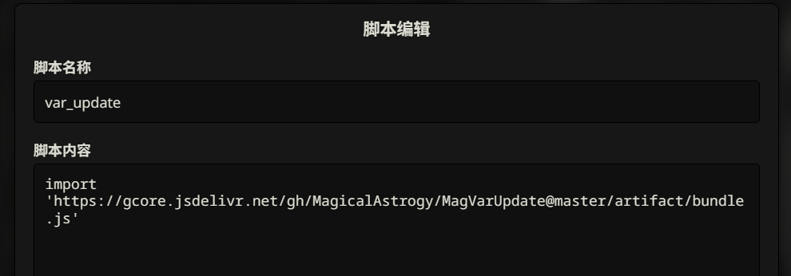
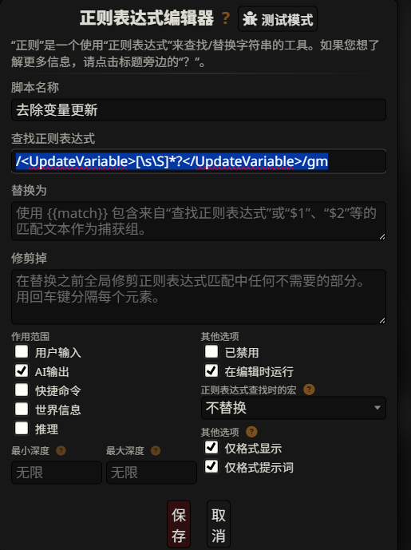

# 前言
目前基于正则变量更新的好感度方案，在实际使用上，存在下面的问题：
1. 需要针对 llm 的各种抽风，边缘状态与正则表达式塔塔开。
2. 无法随意隐藏较早楼层，需要在 `<FullVariableUpdate>` 产生后，才能将之前的楼层隐藏，否则会出现变量不一致的问题。
3. 需要持续对所有楼层进行正则处理，有较高的运行时开销。

为了解决这个问题，我开发了另一套脚本，会在每次 llm 生成完消息时，对消息里的变量变更进行扫描，读取里面的变更记录。

这种做法通过代码编写做到了：
1. 引入了一种新的不依赖于Check的变量更新条件描述方法，以及对应的初始值设定方式。
2. 支持根据开局设置变量初始值
3. 要求类似代码的格式输出，避免llm填写错误。
4. 在变量更新时设置回调，编写专有逻辑(在这张角色卡里用于可靠的日期切换，避免llm有时候忘了日期+1)
5. 变量记录不依赖于过往楼层，可以随时隐藏/删除。
6. 可以将整个变量json 传给 llm，让它设计状态栏。在这种严格格式化的场景，往往能取得很好的效果。
7. 支持在全局世界书中使用，只不过不能有重复的 `variable` 世界书条目，会导致内容的重复发送。

# 安装
与这个工具相关的有一个脚本、两个正则和一个世界书条目，完成下面的步骤即可。

1. 在你自己的角色卡中，新增一个局部脚本，内容为：
```
import 'https://gcore.jsdelivr.net/gh/MagicalAstrogy/MagVarUpdate@master/artifact/bundle.js'
```

如图所示：

点击确认后启用这个脚本即可。

2. 在你的角色卡中，新增一个局部正则`去除变量更新`，内容为：
```
/<UpdateVariable>[\s\S]*?</UpdateVariable>/gm
```
作用范围配置为 `AI输出`，其他选项配置为 `仅格式显示` `仅格式提示词`。如图所示：


新增另一个局部正则 `对 AI 隐藏状态栏`，内容为：
```
<StatusPlaceHolderImpl/>
```
作用范围配置为 `AI输出`，其他选项配置为 `仅格式提示词`。如图所示：

3. 在你的角色使用的世界书中，新增下面的 `蓝灯 D1` 条目，作用是将变量列表输出给 llm，并说明变量更新的规则:
```ejs
<status_description>//do not output following content
    {{get_message_variable::stat_data}},
</status_description>//do not output content below directly
<Analysis>$(IN ENGLISH$)
    - calculate time passed: ...
    - decide whether dramatic updates are allowed as it's in a special case or the time passed is more than usual: yes or no
    - list every variable in `<status_description>` section before actual variable analysis: ...
    - Analyze whether this variable satisfies its change conditions, do not output reason:...
    - Ignore summary related content when evaluate.
</Analysis>

rule:
description: You should output the update analysis in the end of the next reply
analysis:
    - You must rethink what variables are defined in <self_description> property, and analyze how to update each of them accordingly
    - For counting variables, change it when the corresponding event occur but don't change it any more during the same event
    - When a numerical variable changes, check if it crosses any stage threshold and update to the corresponding stage
    - if dest element is an array, only update and only output the first element, not `[]` block.
    format: |-
    <UpdateVariable>
        <Analysis>
            ${path}: Y/N
            ...
        </Analysis>
        _.set('${path}', ${old}, ${new});//${reason}
    </UpdateVariable>
    example: |-
    <UpdateVariable>
        <Analysis>
            悠纪.好感度: Y
            暮莲.日程.周三.上午: Y
            ...
        </Analysis>
        _.set('悠纪.好感度', 33,35);//愉快的一次讨论，悠纪觉得与你一起是开心的
        _.set('暮莲.日程.周三.上午', "空", "地点：data_center_zone.数据服务器室 行为：检查");//暮莲规划了周三上午的日程
    </UpdateVariable>
```

在配置完上面的内容后，你就完成了安装。可以通过 Sillytavern 的命令行，确定实际发出的内容。
# 使用
下面，将从各个方面的特性，介绍安装了这个工具(后称MVU)之后，应当在角色卡中如何使用它。

## 问题定位

### 检查变量状态
大部分情况下，发生问题时都需要检查 SillyTavern 的命令行，以及当前的变量状态。当前的变量状态可以通过安装插件 `https://github.com/LenAnderson/SillyTavern-Variable-Viewer/` 来显示。然后, 你可以在聊天框输入 /variableviewer 来开关变量查看器。

### 检查更新操作
此外，每次 llm 输出的字符串，也会有专门的段来说明更新的变量，即上面的：
```
    <UpdateVariable>
        <Analysis>
            悠纪.好感度: Y
            暮莲.日程.周三.上午: Y
            ...
        </Analysis>
        _.set('悠纪.好感度', 33,35);//愉快的一次讨论，悠纪觉得与你一起是开心的
        _.set('暮莲.日程.周三.上午', "空", "地点：data_center_zone.数据服务器室 行为：检查");//暮莲规划了周三上午的日程
    </UpdateVariable>
```
可以随时观察输出条目的内容，分析 llm 的更新操作，输出格式是否符合预期。

此处比较核心的是变量更新语句 `_.set('悠纪.好感度', 33,35);//愉快的一次讨论，悠纪觉得与你一起是开心的`，它的含义为 `_.set('变量路径', 老值, 新值);//更新原因`。有时新值会是 `[]` 包裹的字符串，但是也并不影响它正常执行。

### 通过聊天文件检查
变量被记录在聊天文件中，每一个 Assistant 消息都有其对应的变量状态，代表的是在回复完那条消息后，变量被更新到的状态。 你可以导出聊天文件或去存档 (一般在 `SillyTavern/default-user/chats/角色卡名称/聊天文件` ， 更推荐这种， 用 VSCode 打开能看见变量实时更新) 来获取聊天文件， 然后用记事本、VSCode 等查看聊天文件开头。也可以通过修改这个 json 后，重新载入聊天，来进行变量输入的修改。

## 初始值设定
在新的聊天加载，和每一条消息发出之前，MVU 都会检测变量是否进行过初始化。在没有初始化时，会使用所有名字中包含 `[InitVar]` 的世界书条目进行初始化。这个条目可以是关闭的状态。这个世界书条目需要按照指定的 json 格式进行编写，如下：
```json5
{
    "日期": ["03月15日", "今天的日期，格式为 mm月dd日"],
    "时间": [
        "09:00",
        "按照进行行动后实际经历的时间进行更新，每次行动后更新，格式为 hh:mm"
    ],
    "user": {
        "身份": ["新来的牧师", "随故事进展改变"],
        "当前位置": [
            "教堂","user所在位置，移动后改变"
            ],
        "重要经历": ["", "与理发生的重要事情会记录在这"],
        "与理的关系": ["", "当与理的关系阶段发生改变时更新"]
    },
    "理":{
        "当前位置": [
            "教堂","理所在位置，移动后改变"
        ],/*略*/
        "情绪状态": {
            "pleasure": [
                0.1,
                "[-1,1]之间,情绪变化时更新,−1 - 极端痛苦、悲伤、厌恶；1 - 极端喜悦、满足、陶醉。"
            ],/*略*/
        },
        "当前所想": ["今天吃什么好呢？", "理 现在脑子里想的事情，随互动更新"]
    }
}
```
可以注意到，整体的变量遵循 json 的分层结构，一层层嵌套。这种嵌套可以告诉 llm 指定变量的归属和关系，引导它更好地读取和生成变量更新语句。而里面的每一个变量都是以 `["03月15日", "今天的日期，格式为 mm月dd日"]` 这样成对的形式进行编写的。这分别代表着 `变量的初始值` 和 `变量更新的条件、变量相关的信息`。llm 在更新变量时，会读取后面的条件，如果符合再进行更新，并更新为有效的值。如在 `理.情绪状态.pleasure` 中，就描述了取值范围，和取值含义，辅助 llm 更好地理解这个变量。

注：不写条件不意味着 llm 不会进行更新，它也会根据变量的名字来自行判断。

## 不同开局的不同初始值
MVU 同样也支持对应不同的开局，设定初始值，具体方式为在额外问候语的字符串中加入 `<UpdateVariable>` 段，如下面的：
```

然后，她再次抬眸望向你，用一种几乎透明到胆怯程度的语调补上一句：

**“如果您愿意…以后我们可以一起主持礼拜……我可以学一些新的诗篇……只要您觉得合适……”**

<UpdateVariable>
_.set('user.身份', '未知', '新来的牧师');//故事开始的设定
_.set("理.好感度",0,15);//故事开始的设定
</UpdateVariable>
```
这些在额外问候语中的更新语句，会在`[InitVar]` 的基础上进行覆盖，变为此处设定的值。此外，老值可以填写为任意内容，实际上并不关心。

## 变量条件判断
结论上依然是 `不要将复杂条件交给 llm 判断，容易产生矛盾`。老老实实使用 `提示词模板语法` 进行相关的工作。下面是一个分段好感度的例子：
```
<relationship_ri_with_user>
//理在目前好感度下，对<user>的行为特征
<% if (_.has(getvar("stat_data"), '理.好感度.[0]')) {%>
理:
<% if (getvar("stat_data").理["好感度"][0] >= -100 && getvar("stat_data").理["好感度"][0] < 20) { %>
    daily_performance:
      behavior:
        - "她在面对<user>时始终保持有礼而端庄的态度，言行举止透着圣女的庄重与温和，并未表现出太多个人情绪。"
//具体内容略
<% } %>
//重复若干次
</relationship_ri_with_user>
```
需要注意的是此处有两个 if。第一个是通过 `_.has` 检查对应的变量是否存在，即初始化是否已经完成，不加可能导致在第一条消息发送之前提示词模板报错(虽然不影响游玩)。第二个则是具体的变量检查了。 MVU 所有的变量，都会挂在 `stat_data` 下，可以通过 `getvar("stat_data")` 在提示词模板语法中获取。在获取到 `stat_data` 后，即可根据你定义的变量层次进行访问。不要忘了最后的 `[0]`，否则获取到的是一个数组。

### 状态栏显示
对于每一个经过 MVU 处理的消息，尾部都会带

MVU 提供了两个核心的变量，分别是 `stat_data` 和 `display_data`。分别代表当前值，和显示值。两者的区别是：如果一个变量在当前的回复中，进行了更新，在前者中的内容会是 `[最新值, "更新条件"]`，而在后者中是 `"老值->新值(原因)"`。如 `_.set('理.好感度', 66, 74); //接受告白并确认关系，好感度大幅提升` 在 `stat_data.理.好感度` 中是 `[74, ""[-30,100]之间,理对 user 的好感度，在与 理 交流过程中变化，变化范围为 [-5,8]"]`， 在 `display_data.理.好感度` 中是 `66->74(接受告白并确认关系，好感度大幅提升)`。通过 `display_data` 可以在结果中更加细致地显示变量的变更。

在 `html` 代码中，可以通过异步方法`getChatMessages`获得对应的变量，如：
```js
async function initDisplay() {

    const message_data = await getChatMessages(getCurrentMessageId());
    var gameData = message_data[0].data;
    characterData = gameData.display_data;
    if (!characterData)
        characterData = gameData.stat_data;
    //略
}
// 初始化页面
document.addEventListener('DOMContentLoaded', initDisplay);
```
之后即借助llm的帮助，完成整个状态栏。参考:  https://claude.ai/share/fb0d85fe-486a-4184-a3d0-c5dee4053c24
里面比较重要的部分是，需要llm去实现一个 `SafeGetValue` 来处理数组和非数组的情况，具体对话为：
```
我发现问题了，对于所有数组形式的输入数据，还有另一种形式是直接为字符串，如 document.getElementById('li-location').innerText = characterData.理.地点[0];，有时需要document.getElementById('li-location').innerText = characterData.理.地点; 才能取到正确结果，不需要数组。请专门提取一个 SafeGetValue 方法来处理
```

# 总结和样例角色卡地址
MVU 系统为角色卡创作者提供了一个强大而灵活的工具，使得角色的状态管理变得更加可靠和高效。通过本文的指导，我希望能够帮助更多创作者掌握这一工具，创造出更加生动、连贯和沉浸式的角色扮演体验。 无论您是经验丰富的角色卡作者，还是刚刚开始尝试创建自己的角色，MVU 系统都能为您提供实用的支持。期待看到社区中涌现出更多精彩的基于 MVU 的角色创作。

对于这个系统的样例角色卡，是：https://discord.com/channels/1291925535324110879/1367723727827111998

这个角色卡基于 MVU 框架实现了：
1. 设置变量初始值 ([InitVar]1st 世界书条目)
2. 根据开局设置变量初始值
3. 根据输出格式编写角色卡 (对话记录: https://claude.ai/share/fb0d85fe-486a-4184-a3d0-c5dee4053c24)
4. 在变量更新时设置回调，编写专有逻辑(在这张角色卡里用于可靠的日期切换，避免llm有时候忘了日期+1)
5. 基于变量&提示词模板语法，实现分段好感度(relation_level 世界书条目)
6. 基于变量，实现特定触发条件的剧情事件(kokuhaku 世界书条目)

可以参照描述去查看每一个条目，本文中样例代码，也是来自这张角色卡。

# 高阶用法
对于有 js 编写能力的开发者，可以参考 https://github.com/MagicalAstrogy/MagVarUpdate/tree/master/example_src 中的代码，对接 `变量更新时` 的回调。这个样例代码，实现了在 LLM 在日替时如果忘记更新日期了，会替代llm，自己进行更新。

具体而言，主要是提供了下面三种事件：
```
    "mag_variable_updated", //更新时
    "mag_variable_update_ended", //完成整个回复的更新后
    "mag_variable_update_started" //开始整个回复的更新前
```
分别接受下面的函数定义：
```
    [mag_variable_updated]: (stat_data: Record<string, any>, path: string, _oldValue: any, _newValue: any) => void,
    [mag_variable_update_ended]: (variables: GameData, out_is_updated: boolean) => void
    [mag_variable_update_started]: (variables: GameData, out_is_updated: boolean) => void
```
具体可以参考文件 `https://github.com/MagicalAstrogy/MagVarUpdate/blob/master/src/main.ts` 中的声明。
